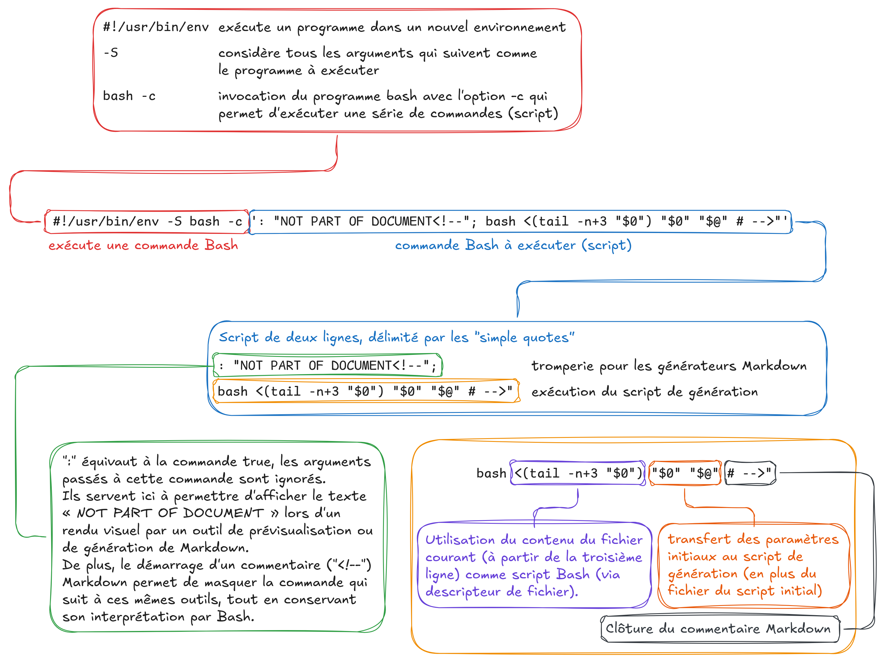

# Un environnement de développement reproductible, sans conteneurs

Ce dépôt contient les fichiers sources de la présentation.

## Structure

Le contenu de la présentation se trouve dans le fichier [`slides.md`](./slides.md). Elle utilise [Marpit](https://marpit.marp.app) pour gérer et générer le jeu de slides.

Les ressources additionnelles se trouvent dans le dossier [`assets`](./assets), lui-même composé de sous-dossiers :

- [`assets/font`](./slides/assets/font) : fichiers de la police de caractère utilisée pour la présentation
- [`assets/images`](./slides/assets/images) : images utilisées pour la présentation

Dans le dossier `assets`, on trouvera également quelques lignes de CSS pour personnaliser le rendu de Marpit.

## Génération

Pour générer les slides, il est préférable de disposer de [Nix](https://nixos.org/download). La génération devient alors aussi simple que d'exécuter le fichier `slides.md` !

```bash
./slides.md

# Génération du fichier de sortie automatique lors d'un changement dans le fichier source
./slides.md -w
```

### C'est de la magie noire ?

Non.

C'est simplement un trick Bash bien cool !

Le fichier Markdown est en fait déclaré comme un script via une instruction shebang (`#!`) qui lance `bash` et exécute le CLI de Marpit (`marp`) avec les bonnes données d'entrée (ie. le contenu Markdown, modulo la partie script).

Bien que j'y ai moi-même pensé par le passé, je n'avais jamais vraiment réussi à obtenir quelque chose d'acceptable. Je dois cette version finale à [Niklas Gollenstede](https://github.com/NiklasGollenstede), qui a accepté de partager avec moi son petit tour de passe-passe, un grand merci à lui !

### Et comment ça marche ?

_« C'est très simple. »_

La première ligne est celle qui porte le plus à confusion. En effet, il y a plusieurs niveaux de lecture :



Enfin, le reste des lignes sont celles qui composent le script qui effectue la génération des slides :

```bash
# On s'assure que Nix est installé et disponible
command -v nix-shell &>/dev/null || { echo "Nix is required to run this script! Visit https://nixos.org/download/"; exit; }

# On déclare la révision de nixpkgs à utiliser
nixpkgs=64b80bfb316b57cdb8919a9110ef63393d74382a

# On déclare les paquets à utiliser dans le shell Nix
packages=( coreutils marp-cli inotify-tools )

# On déclare la commande à exécuter dans le shell Nix
command=( tail -n+13 "$1" "|" marp -o "${1%.md}".html "${@:2}" )

# On déclare la commande pour démarrer le shell Nix
nixcmd=( nix-shell --pure -p "${packages[@]}" -I nixpkgs=https://github.com/nixos/nixpkgs/archive/$nixpkgs.tar.gz --run )

# Si un des paramètres démarre par -w, on considère que le mode suivi a été demandé (et on supprime le paramètre de la commande)
if [[ " $* " =~ [[:space:]]-w[[:space:]] ]]; then echo "Watch required"; watch=true; fi
command="${command[*]//--watch/}"; command="${command//-w/}"

# On exécute la commande déclarée dans le shell Nix
"${nixcmd[@]}" "$command"

# Si le mode suivi a été demandé, on démarre une boucle inotify dans le shell Nix qui va exécuter la commande déclarée à chaque changement dans le fichier source
if [[ "$watch" = "true" ]]; then "${nixcmd[@]}" 'while inotifywait -qq -e close_write '"$1"'; do '"$command"'; done'; fi

# Sortie du script (sinon le contenu Markdown est interprété comme du Bash…)
exit # end script, begin document: -->
```

> [!NOTE]
> **Petite subtilité pour l'option `-w` !**
>
> Étant donné que le contenu du fichier est tronqué pour supprimer la partie scripting avant de l'envoyer à Marpit, cette option n'utilise pas la fonctionnalité du CLI Marpit puisqu'il n'est pas possible de surveiller les changements d'un descripteur de fichier.
>
> Afin de la remplacer, une boucle `inotifywait` est mise en place et surveille le fichier d'origine pour le regénérer lors d'un changement.
>
> Bien que fonctionnel, le rechargement automatique ne fonctionne pas dans le navigateur avec cette méthode (contrairement à l'option intégrée au CLI Marpit).

## Application de démonstration

Le code de l'application de démonstration se trouve dans une [branche séparée du dépôt](https://github.com/nicolas-goudry/reproducible-dev-env/tree/demo-app).

## Licence

[Un environnement de développement reproductible, sans conteneurs](https://github.com/nicolas-goudry/reproducible-dev-env) © 2024 par Nicolas Goudry est sous licence [CC BY-NC-SA 4.0](https://creativecommons.org/licenses/by-nc-sa/4.0) 
