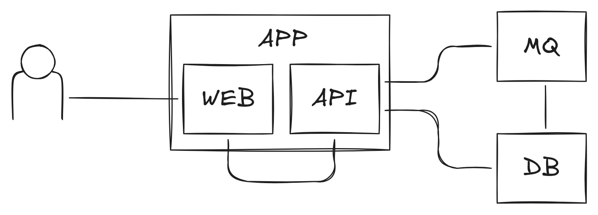

#!/usr/bin/env -S bash -c ': "NOT PART OF DOCUMENT<!--"; bash <(tail -n+3 "$0") "$0" "$@" # -->"'
<!-- Slightly modified hack, courtesy of Niklas Gollenstede
command -v nix-shell &>/dev/null || { echo "Nix is required to run this script! Visit https://nixos.org/download/"; exit; }
nixpkgs=64b80bfb316b57cdb8919a9110ef63393d74382a
packages=( coreutils marp-cli inotify-tools )
command=( tail -n+13 "$1" "|" marp --bespoke.transition -o "${1%.md}".html "${@:2}" )
nixcmd=( nix-shell --pure -p "${packages[@]}" -I nixpkgs=https://github.com/nixos/nixpkgs/archive/$nixpkgs.tar.gz --run )
if [[ " $* " =~ [[:space:]]-w[[:space:]] ]]; then echo "Watch required"; watch=true; fi
command="${command[*]//--watch/}"; command="${command//-w/}"
"${nixcmd[@]}" "$command"
if [[ "$watch" = "true" ]]; then "${nixcmd[@]}" 'while inotifywait -qq -e close_write '"$1"'; do '"$command"'; done'; fi
exit # end script, begin document: -->
---
title: Un environnement de développement reproductible, sans conteneurs
date: 2024-10-25
author: Nicolas Goudry
affiliation: https://github.com/nicolas-goudry
theme: default
paginate: true
transition: coverflow
backgroundColor: #eeeee4
style: |
  @import url('./assets/index.css');
---


# Un environnement de développement reproductible

_…et sans conteneurs !_

<!--
_footer: © Nicolas Goudry – 2024
_paginate: skip
-->

<!--
Aujourd'hui, on va parler ensemble des environnements de développement reproductibles, mais sans conteneurs !

Je pense que beaucoup d'entre vous ont déjà entendu parler de Docker et des conteneurs, mais on va quand même prendre la température :

Trois questions simples
Une seule règle : si la réponse est oui, vous levez la main, sinon vous la baissez.

- est-ce que vous connaissez Docker ?
- est-ce que vous avez déjà lancé un conteneur sur votre machine
- est-ce que vous utilisez les conteneurs de manière quotidienne

On va quand même passer rapidement sur les bases des conteneurs, mais promis : il n'y a qu'une slide !
-->

---


## Les conteneurs… Quèsaco ?

* forme de virtualisation embarquant le code et les dépendances d'une application
* reproductible
* utilise les ressources physiques de l'hôte (ainsi que son noyau)
* isolé du système hôte et de ses applications

<!--
Les conteneurs, on les connait depuis un bon moment maintenant
Quand ils sont arrivés, ils ont eu l'effet d'une petite bombe

Pourtant, la conteneurisation, c'est pas vraiment nouveau
Elle a été démocratisée par Docker, mais ils n'ont rien inventé

Ils se sont basé sur des technologies un peu obscures créées par Google : cgroups et namespaces
Des trucs pour les barbus qui vivent dans les salles machines quoi

Mais même avant ça, on utilisait déjà des choses come chroot pour isoler les processus de l'hôte
Là où les conteneurs se démarquent, c'est par leur simplicité d'utilisation

--break--

Du coup, c'est quoi les conteneurs ?

--next--

Les conteneurs sont une forme de virtualisation dans laquelle on embarque le code et les dépendances d'une application
Une sorte de petite boîte noire qui contient tout ce que notre code a besoin pour être exécuté

--next--

La plupart du temps, les conteneurs sont reproductibles, fini l'excuse du “oui mais ça fonctionne chez moi”
Pourtant, on voit souvent des images de conteneurs qui ne sont pas très reproductibles :
- les dépendances ne sont pas fixées
- l'image de base utilise un tag “mouvant” (qui se déplace entre différentes itérations de l'image)
- etc…

--next--

Enfin, les conteneurs utilisent les ressources de leur hôte (CPU, RAM, disque, noyau)

--next--

Et ils sont isolés du système et des applications utilisateurs
Un peu de la même manière que chroot

--break--

Maintenant qu'on est tous sur la même page, on va rentrer dans le vif du sujet
J'ai préparé une petite application web composée de différents services classiques
Et je me suis fait un environnement de dev avec Docker compose
-->

---

# Environnement avec Docker compose

```yaml
name: chat-app

services:
  db:
    image: postgres:17.0
    restart: always
    environment:
      POSTGRES_PASSWORD: bestpass

  mq:
    image: rabbitmq:4.0.2-management
    restart: always
    ports:
      - "15672:15672"

  app:
    build: .
    depends_on:
      - db
      - mq
```

<!--
Ce que vous voyez derrière moi est un fichier Docker compose
Si vous connaissez Docker et utilisez les conteneurs régulièrement, vous avez sûrement déjà vu ce genre de fichier

Pour faire simple, compose est un outil intégré à Docker qui permet de composer (justement) plusieurs conteneurs (qu'on appelle services)
Ces conteneurs pourrons alors être lancés en parallèle avec une seule commande (docker compose up)
Ça permet d'obtenir un environnement complet d'exécution pour son application

L'avantage de compose c'est que la couche réseau est gérée automatiquement, tous les services peuvent communiquer entre eux
On ne va pas rentrer dans les détails puisque je vous ai dit qu'on utiliserait pas les conteneurs pour notre environnement
Mais compose dispose de nombreuses autres options, on voit ici les options les plus basiques

J'ai donc donné un nom à ma composition via l'option name
Et j'ai défini 3 services (donc 3 conteneurs)
Les deux premiers services sont une base de données (postgres) et une queue de messages (rabbitmq)

Pour chacun, on utilise une image venant du registre Docker (image)
On indique également que les conteneurs doivent être redémarrés en cas de terminaison avec l'option restart: always

On définit un mot de passe par défaut pour postgres en utilisant une variable d'environnement
Et on expose l'interface de gestion de rabbit sur un port local 15672, qui est le même que celui sur lequel l'interface est exposée au sein du conteneur

Enfin, on déclare notre application en précisant qu'elle doit être construite depuis le dossier courant en utilisant le fichier Dockerfile
On indique également que l'application doit attendre que postgres et rabbit soient démarrés avant d'elle-même être démarrée
Elle est dépendante des deux autres conteneurs

En théorie, tout ça devrait bien fonctionner, et pourtant je vois plusieurs problèmes avec cette approche
-->

---


## Les “problèmes” de cette approche

* moteur de conteneur requis
* temps de compilation/transpilation et rechargement à chaud
* mise en réseau _(sans compose)_
* accès aux services depuis l'hôte

<!--

--next--

Le premier problème, c'est qu'on a besoin d'un moteur de conteneur justement
Un truc qui sache comment exécuter ces fameux conteneurs (docker, containerd, nerdctl, podman, you name it)
Et je ne vous parle même pas de Docker Desktop
Un outil de plus à installer, qui va encore bouffer notre RAM et notre CPU
Pas cool quand on a déjà 36 instances de Chrome avec des centaines d'onglets

--next--

Deuxième problème, le plus contraignant quand on fait du dev, c'est qu'il faut construire une image de conteneur
Et ça peut prendre longtemps, trèèès longtemps même selon la stack utilisé (dédicace à Java et à Node.js)

Et justement, si on parle d'application web, on peut dire adieu au “hot reload”
Bon, ok, ça on peut le conserver en utilisant des tours de passe-passe avec les volumes et un peu de bash saupoudré d'inotify

--next--

En plus, si on décide de ne pas utiliser compose, on va avoir de nouveaux problèmes
Parce que, mettre en réseau des conteneurs sans compose, c'est relou. Il faut créer un réseau, dire de quel type il est, tout bien configurer
Et je ne vous parle même pas des certificats TLS

--next--

Et l'accès aux services depuis l'hôte ? Aussi simple que d'exposer un port ?
Si le cas d'usage est basique : oui
Mais dès qu'on veut faire des trucs un peu sioux, c'est la croix et la bannière
Et on finit souvent par tout exposer sur le réseau local de toute façon
Franchement, ce serait pas mieux d'utiliser des sockets ?

--break--

Ok, j'ai bien bashé sur les conteneurs mais…
-->

---


## Les conteneurs c'est trop génial

- pour la production
- pour des services unitaires

## Mais finalement pas tant que ça

- pour le développement
- pour des piles de services

<!--
Les conteneurs, c'est trop génial

Oui oui, POUR LA PROD, sur des services unitaires, dans des orchestrateurs comme Kubernetes ou Nomad
Ça fonctionne bien, c'est rapide, fiable, c'est une super solution

Mais, pour le dev, c'est vraiment pas ouf
Un dev, ça veut coder, pas transformer son poste en serveur et jouer à l'admin sys

Du coup, c'est quoi les alternatives ? Ben il y en a plusieurs.
-->

---


# Les alternatives

* lancement des services “brut”
* [nix](https://nix.dev/), [flakes](https://nix.dev/concepts/flakes.html) & [direnv](https://direnv.net/)
* [flox](https://flox.dev/) / [devbox](https://www.jetify.com/devbox) / [devenv](https://devenv.sh/)

<!--
Déjà, on va partir du principe que quand on dev, l'isolation apportée par les conteneurs, on s'en fout quand même royalement

--next--

Du coup, on pourrait simplement tout lancer en “brut” sur notre poste
Mais dans ce cas là, on oublie la reproductibilité et on en revient à “ça fonctionne sur ma machine”
C'est dommage et c'est pas ce qu'on cherche à faire, du coup on écarte cette solution tout de suite

--next--

On en vient au vif du sujet : des solutions entièrement reproductibles, avec un degré variable de complexité
Avant de vous parler de ces solutions : qui connaît Nix ici ? NIX, pas Unix

La première solution qu'on va explorer, c'est un peu comme Kubernetes the hard way pour ceux qui connaissent
Mais ça a l'avantage d'être hyper flexible
On va d'abord voir comment on peut tirer parti de nix (avec les flakes activés) en l'associant à direnv

--next--

Ensuite, une fois qu'on aura pleuré du sang et transpiré des larmes, on va voir des solutions beaucoup plus friendly
Toutes ces solutions utilisent Nix under the hood, c'est d'ailleurs pour ça qu'on va commencer par la méthode Viking

Mais avant, je vais vous présenter un peu notre application de démo
-->

---

<!-- _class: demo_app -->

# Application de démonstration

Simple messagerie instantanée utilisant les composants suivants



##### APP_ADDRESS_HERE

<!--
Rien de bien compliqué, une application web tout ce qu'il y a de plus basique :
Quelques milliers de lignes de HTML, CSS et JS
Accompagnées d'un serveur API et de deux services “on the shelf”

Prions les demo gods : vous devriez pouvoir accéder à l'application à l'adresse indiquée en bas de la slide

Je vous préviens tout de suite par contre, c'est pas du code très propre, c'est pas sécurisé et il y a probablement des gros bugs un peu partout
Mais c'est pas ce qui nous importe ici
-->
