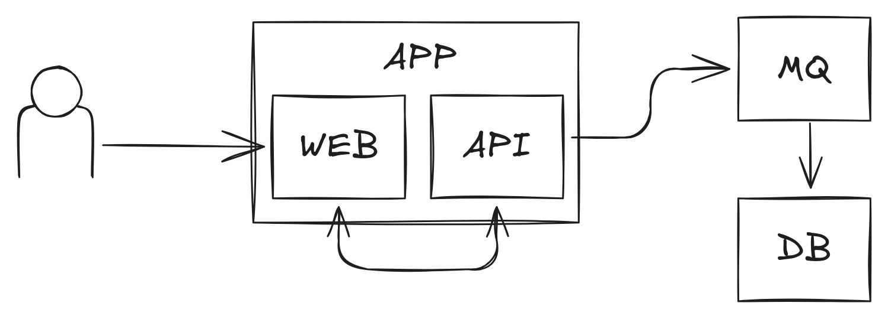

# Reproducible development environments

_without containers!_

<!--
_footer: © Nicolas Goudry – 2024
_paginate: skip
-->

---


# What are containers?

- unit of software packaging up application code and their dependencies
- reproducible
- running on host physical resources (and kernel)
- isolated from host system/applications

<!--
Containers are known and widely used since quite some time now
But they are not at all something new
Docker democratized containers as we know them today, but they didn’t invent anything
They built on an obscure piece of technology pushed by Google in the Linux kernel: cgroups and namespaces
Even before that, we used chroot when isolation from the host was required
-->

---

# Quick demo

```yaml
name: chat-app

services:
  db:
    image: postgres:17.0
    restart: always
    environment:
      POSTGRES_PASSWORD: bestpass

  mq:
    image: rabbitmq:4.0.2-management
    restart: always
    ports:
      - "15672:15672"

  app:
    build: .
    depends_on:
      - db
      - mq
```

<!--
This is a Docker compose file
It is very likely that you already heard about them, and maybe are even using them on a daily basis
In a nutshell, compose files allow to declare multiple services (ie. containers) to run in parallel with a single command (`compose up`)
Compose handle the networking parts so that all services can communicate
There are many more options available, those are the most basic ones
Here we run:
- a PostgreSQL database with a super secure password
- a messaging queue which has it’s management interface exposed to the host
- our app after both database and messaging queue services are up
Our app is built from source with a local Dockerfile
-->

---


# “Issues” of this approach

- container engine required
- services access from host
- build time / hot reloading
- networking _without compose_

<!--
Such approach obviously requires a container engine/runtime to be available (Docker here because we use the compose specification)
To access services from the host network, we explicitly need to bind local ports to container ports (know about Unix sockets folks?)
Every time we change our app code, we have to rebuild the whole app container
If our app is web-based, say goodbye to hot reloading (ofc there are tricks to handle such limitations, but they are tricks)
If we weren’t using compose, we’d have to create a custom network where all our containers would live
-->

---


# Containers are great!

- for production
- for single services

# Containers are not great!

- for development
- for stacks of services

<!--
Sure, containers are really good for production, just look at Kubernetes
It works, its fast, reliable. It's a great solution
But, for development, it’s really not very good as we saw previously
Running whole stack of services in a dev context can become quite cumbersome
The container advantages fade away
-->

---


# Thinking of alternatives

- bare services running
- [nix](https://nix.dev/), [flakes](https://nix.dev/concepts/flakes.html) & [direnv](https://direnv.net/)
- [flox](https://flox.dev/) / [devbox](https://www.jetify.com/devbox) / [devenv](https://devenv.sh/)

<!--
Since we don’t really care of isolation when running a development environment, we will explore the following solutions
- running everything from our computer
- discover nix and direnv
- using flox and devenv, which abstract the nix parts from the previous setup
-->

---

# The app

Simple web-based chat app with the following structure


